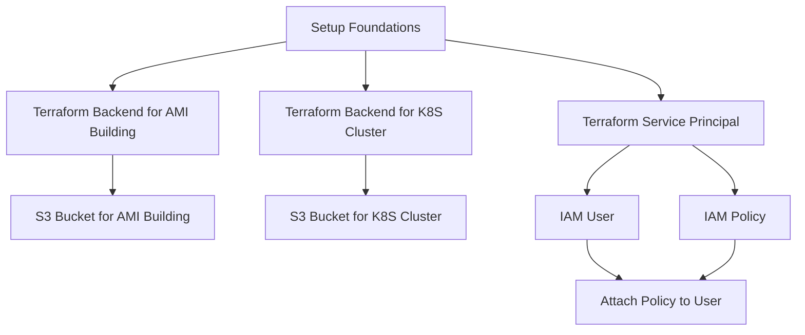
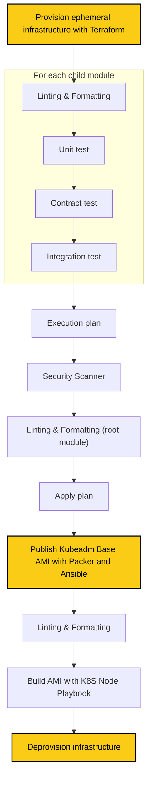

# Cloud Homelab: Kubernetes Cluster (with kubeadm) on AWS

## Description

This project sets up a Kubernetes cluster on AWS using `kubeadm`, as part of my hands-on journey to deepen my cloud-native and DevOps skills. After completing [Kubernetes the Hard Way](https://github.com/hoaraujerome/kubernetes-the-hard-way-on-aws) to understand the internals, I built this homelab environment to prepare for the Certified Kubernetes Administrator (CKA) exam and eventually host real-world workloads.

The infrastructure is provisioned using `Terraform`, and custom AMI for the control plane and worker nodes are built with `Packer` and `Ansible`. Nodes are deployed in private subnet, and I use `EC2 Instance Connect` for secure SSH access. For container networking, I chose `Cilium` as the CNI plugin to explore modern, eBPF-powered Kubernetes networking.

While my current job operates 100% in **Azure**, I deliberately chose **AWS** for this project to strengthen my **multi-cloud proficiency** and broaden my cloud engineering expertise.

I believe the best way to learn is to **get your hands dirty** — and this repo is a reflection of that mindset: learning by building, breaking, and improving.

To streamline development and ensure consistent tooling across environments, I use Devbox to manage the developer setup.

## Badges


[](https://lazyvim.org/)
[](http://creativecommons.org/licenses/by-nc-sa/4.0/)

## Visuals

### Infrastructure


## Installation

### Requirements

- AWS Account
- AWS CLI configured
- [devbox](https://www.jetify.com/devbox)

### Steps

1. Initialize the environment:

   ```sh
   devbox init
   ```

2. Start the environment:

   ```sh
   devbox shell
   ```

3. Setup foundations:

   ```sh
   make foundations
   ```



4. Build the Kubeadm Base AMI Provision:

   ```sh
   make images-config-build
   # skipping tests flag available: SKIP_TESTS="1" make images-config-build
   ```



## Contributing

This project is a personal learning endeavor, and contributions are not being accepted at this time.

## Developer Setup

### Requirements

- [devbox](https://www.jetify.com/devbox)
- [pre-commit](https://pre-commit.com/)

### Steps

1. Clone this repo and cd
2. Initialize the dev environment:

   ```sh
   devbox init
   ```

3. Start the dev environment:

   ```sh
   devbox shell
   ```

4. Install `pre-commit` hooks:

   ```sh
   pre-commit install
   ```

5. (Optional) Run pre-commit on all files:

   ```sh
   pre-commit run --all-files
   ```

## Usage

- SSH to an EC2 instance

   ```sh
   AWS_PROFILE="k8s_homelab" aws ec2-instance-connect ssh --instance-id i-07eb24daa48842f91 --os-user ubuntu --connection-type eice

   export AWS_PROFILE="k8s_homelab"
   ssh -i ~/.ssh/id_rsa_k8s_homelab ubuntu@i-07eb24daa48842f91 -o ProxyCommand='aws ec2-instance-connect open-tunnel --instance-id i-07eb24daa48842f91'
   ```

- Smoke tests

   ```sh
   root@ip-10-0-1-114:~ export KUBECONFIG=/etc/kubernetes/admin.conf

   root@ip-10-0-1-114:~ cilium status --wait
          /¯¯\
    /¯¯\__/¯¯\    Cilium:             OK
    \__/¯¯\__/    Operator:           OK
    /¯¯\__/¯¯\    Envoy DaemonSet:    OK
    \__/¯¯\__/    Hubble Relay:       disabled
       \__/       ClusterMesh:        disabled
   
   DaemonSet              cilium                   Desired: 2, Ready: 2/2, Available: 2/2
   DaemonSet              cilium-envoy             Desired: 2, Ready: 2/2, Available: 2/2
   Deployment             cilium-operator          Desired: 1, Ready: 1/1, Available: 1/1
   Containers:            cilium                   Running: 2
                          cilium-envoy             Running: 2
                          cilium-operator          Running: 1
                          clustermesh-apiserver
                          hubble-relay
   Cluster Pods:          2/2 managed by Cilium
   Helm chart version:    1.17.4
   Image versions         cilium             quay.io/cilium/cilium:v1.17.4@sha256:24a73fe795351cf3279ac8e84918633000b52a9654ff73a6b0d7223bcff4a67a: 2
                          cilium-envoy       quay.io/cilium/cilium-envoy:v1.32.6-1746661844-0f602c28cb2aa57b29078195049fb257d5b5246c@sha256:a04218c6879007d60d96339a441c448565b6f86650358652da27582e0efbf182: 2
                          cilium-operator    quay.io/cilium/operator-generic:v1.17.4@sha256:a3906412f477b09904f46aac1bed28eb522bef7899ed7dd81c15f78b7aa1b9b5: 1

   root@ip-10-0-1-114:~ kubectl get nodes -o wide
   NAME            STATUS   ROLES           AGE     VERSION   INTERNAL-IP   EXTERNAL-IP   OS-IMAGE             KERNEL-VERSION   CONTAINER-RUNTIME
   ip-10-0-1-173   Ready    <none>          7m15s   v1.32.4   10.0.1.173    <none>        Ubuntu 24.04.2 LTS   6.8.0-1029-aws   containerd://1.7.27
   k8scp           Ready    control-plane   7m49s   v1.32.4   10.0.1.114    <none>        Ubuntu 24.04.2 LTS   6.8.0-1029-aws   containerd://1.7.27

   root@ip-10-0-1-114:~ kubectl create deployment nginx --image=nginx
   deployment.apps/nginx created

   root@ip-10-0-1-114:~ kubectl get pods -o wide
   NAME                     READY   STATUS    RESTARTS   AGE   IP             NODE            NOMINATED NODE   READINESS GATES
   nginx-5869d7778c-2wphd   1/1     Running   0          33s   10.244.1.146   ip-10-0-1-173   <none>           <none>
   ```
  
## Authors and Acknowledgment

- **Hoarau Jerome** - [GitHub](https://github.com/hoaraujerome)

## License

This project is licensed under the Creative Commons Attribution-NonCommercial-ShareAlike 4.0 International License. For more details, see the LICENSE file or visit <http://creativecommons.org/licenses/by-nc-sa/4.0/>.

## Project Status

✅ **Phase 1 Completed**

The Kubernetes cluster is successfully deployed on AWS using `kubeadm` and self-managed EC2 instances. This phase included:

- Infrastructure as Code setup for 1 control plane node and 1 worker node
- End-to-end automation: AMI building (Packer + Ansible), infrastructure provisioning (Terraform), and cluster bootstrapping
- Secure access to the Kubernetes API server from the local machine
- Devbox is used to streamline the development environment, making it easier to work consistently across my personal workstations.

🚧 **Phase 2 is planned**, but its scope is yet to be defined.
